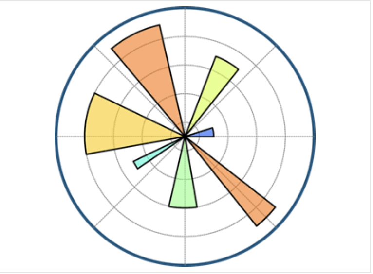
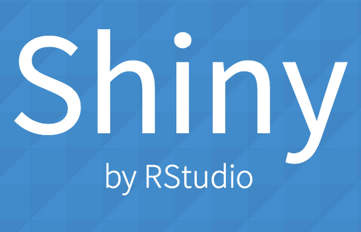

<h1 align="center"> Jesús Cantú Jr. </h1>

  

<h1 align="center"></h1>

  <!-- Images aligned to the left -->
  

    
    
    
  

  <!-- About Me section on the right -->
  

    <h3>About Me :sunglasses:</h3>
    
Jesús Cantú is a skilled Data Scientist based in Chicago, IL. With a strong foundation in programming languages, he leverages his technical expertise to excel in data science and machine learning. And is experienced in applying various techniques, including Deep Learning/Neural Networks, Unsupervised Learning, Regression models, and Data Processing/Visualization.

Jesús holds a Data Science Engineer Certification from The Data Incubator (2023), a M.S. in Software Engineering from Loyola University - Chicago (2023) :wolf:, and a B.A. in Sociology from Princeton University (2017) :tiger:. He considers himself an interdisciplinary & data-driven problem solver with a passion for science, technology, and their application for the betterment of mankind.

  

<h2 font-weight="bold">Skill Set :books:</h2>
<!-- Heading 2 element with the text "Software Skills" -->

<table>
  <tr>
    <th>Software</th>
    <th>Software Name</th>
    <th>General Purpose</th>
    <th>Years of Experience</th>
    <th>Expert Level</th>
  </tr>
  <tr>
    <td>
      
      
      
      
      
      
    </td>
    <td>Python, R, SQL, C#, Java, Bash</td>
    <td>Programming Languages</td>
    <td>3 years, 5 years, 2 years, 2 years, 4 years</td>
    <td>Adv., Adv., Inter., Novice, Novice, Inter.</td>
    </td>
  </tr>
  <tr>
    <td>
      
      
      
    </td>
    <td>TensorFlow, PyTorch, Scikit-Learn</td>
    <td>Machine Learning Libraries</td>
    <td>1 year, 1 year, 1 year</td>
    <td>Novice, Novice, Novice</td>
    </td>
  </tr>
  <tr>
    <td>
      
      
      
      
      
    </td>
    <td>Pandas, Matplotlib, Seaborn, Shiny, Power BI</td>
    <td>Data Visualization Libraries</td>
    <td>3 years, 3 years, 3 years, 4 years, 1 year</td>
    <td>Adv., Adv., Adv., Adv., Novice</td>
    </td>
  </tr>
  <tr>
    <td>
       
       
       
       
    </td>
    <td>MySQL, PostgreSQL, SQLAlchemy, MongoDB</td>
    <td>Database Technologies</td>
    <td>3 years, 3 years, 1 year, 2 years</td>
    <td>Inter., Inter., Novice, Inter.</td>
    </td>
     </td>
  </tr>
  <tr>
    <td>
       
      
      
      
      
    </td>
    <td>Hbase, Phoenix, Hive, Impala, Spark</td>
    <td>Big Data Technologies</td>
    <td>1 year, 1 year, 1 year, 1 year, 2 years</td>
    <td>Novice, Novice, Novice, Novice, Inter.</td>
    </td>
  </tr>
  <tr>
   </td>
  </tr>
  <tr>
    <td>
      
      
      
    </td>
    <td>AWS, GCP, Databricks</td>
    <td>Cloud Computing Services</td>
    <td>1 year, 1 year, 1 year</td>
    <td>Inter., Novice, Novice</td>
    </td>
     </td>
  </tr>
  <tr>
    <td>
       
      
      
      
    </td>
    <td>Docker, Bitbucket, Visual Studio Code, Git</td>
    <td>DevOps/td>
    <td>1 year, 1 year, 2 years, 4 years</td>
    <td>Novice, Novice, Inter., Adv.</td>
    </td>
  </tr>
  <tr>
   </td>
  </tr>
  </tr>
  <table>
  

